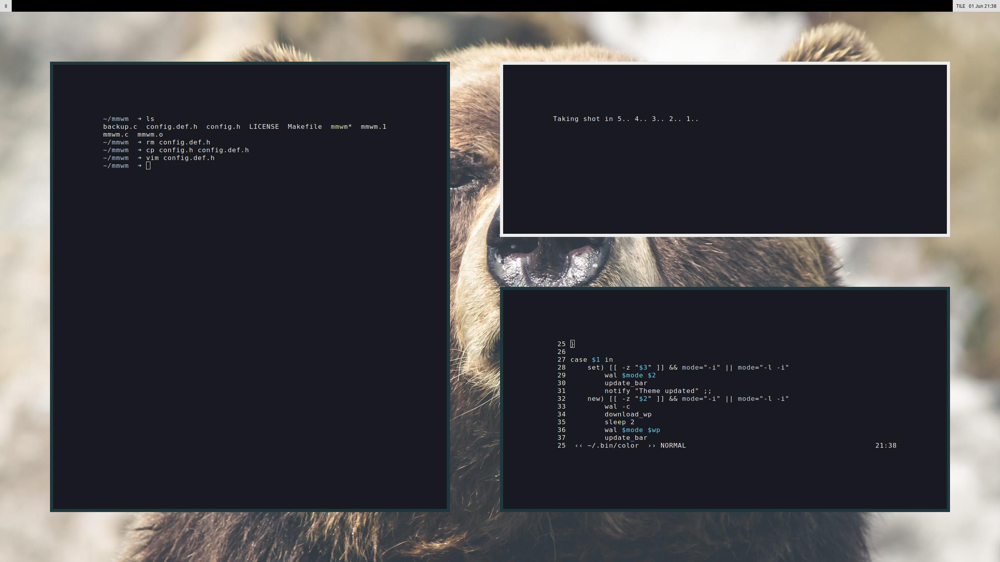

# mmWM
#### Modern Minimalistic Window Manager (WIP, stripped down FrankenWM)

mmWM is a dynamic window manager that is heavily based off of FrankenWM. In fact, it is FrankenWM, but with many _unnecessary_ functions removed (and some unique features added). mmWM is designed to simplify a tiling workflow, with less, more logical hotkeys, and more automated window management.

mmWM is designed to provide an aesthetic and minimalistic desktop as it prevents window overcrowding. If a desktop is _full_, mmWM will open the window on the next desktop. Likewise, if a window is the only one on a desktop, mmWM will switch to the previous desktop when the window is killed to speed up your workflow.

mmWM is lightweight. `smem` outputs USS and PSS at 384k and 439k respectively.

#### Modern and Minimalist Approach
Heavy gaps between windows\
Slim, global borders for _all_ windows\
No per-app rules. All windows start tiled and focused on current desktop (unless desktop is _full_)\
Simplified, fewer, and more logical keyboard shortcuts\
2 tiling modes: Tile (master/slave) and Equal (and floating on a per window basis)\
Tiled windows are interacted with by the keyboard\
Floating windows are interacted with by the mouse (except using the keyboard to pop them out)

#### Added features
Automated desktop switching when opening a new window in a _full_ desktop\
Automated focusing on previous _populated_ desktop if last window on desktop is killed\
User can define the maximum number of allowed windows per desktop\
Disabled inverting stack in equal mode (no horizontally maximized windows because they're ugly)\
Hotkey & function to swap between the 2 main tiling modes\
Hotkey & function to pop a window in and out of floating mode\
Solitary and fullscreen windows on the desktop now have borders

#### TODO
Still some vestiges of unused features: scratchpad\
Clean up the code\
Update border color on the fly for theming

Installation
------------

You need xcb and xcb-utils then, copy `config.def.h` as `config.h` and edit to
suit your needs.  Build and install.

    $ cp config.def.h config.h
    $ $EDITOR config.h
    $ make
    # make clean install

The packages in Arch Linux needed for example would be
`libxcb` `xcb-util` `xcb-util-wm` `xcb-util-keysyms`

Configuration
-------------

You can configure mmWM by editing `config.h` before compiling.\
You can add / remove / modify functions by editing `mmwm.c` and searching for `void [function]` and making changes there.

Usage
-----

Without panel: Add the following to your `.xinitrc`

    $ exec mmwm &

With panel: Download a panel script from [FrankenWM's Github page](https://gist.github.com/sulami/d6a53179d6d7479e0709), make it executable, and save it somewhere\
Add the following to your `.xinitrc`

    $ exec [PATH TO BAR SCRIPT]

Thanks
------

[FrankenWM by sulami](https://github.com/sulami/FrankenWM)

