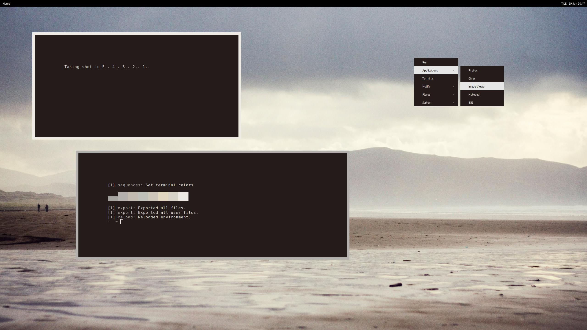

# mmWM
#### Modern Minimalistic Window Manager

mmWM is a dynamic window manager that is heavily based off of FrankenWM but 25% smaller. In fact, it is FrankenWM, but with many _unnecessary_ features stripped out, and others added . Its goal is to simplify your tiling workflow, with less, more logical hotkeys, and more automated window management.

mmWM is designed to provide an aesthetic and minimalistic desktop as it prevents window overcrowding. If a desktop is _full_, mmWM will open the window on the next desktop. Likewise, if a window is the only one on a desktop, mmWM will switch to the previous desktop when the window is killed to speed up your workflow. Additionally, mmWM supports theming from pywal.

mmWM is suuuuuuuper lightweight. `smem` outputs USS and PSS at 388k and 438k respectively.

#### Modern and Minimalist Approach
Heavy gaps between windows\
Slim, global borders for _all_ windows\
No per-app rules. All windows start tiled and focused on current desktop (unless desktop is _full_)\
Simplified, fewer, and more logical keyboard shortcuts\
2 tiling modes: Tile (main & secondary) and Equal (and floating on a per window basis)\
Tiled windows are interacted with by the keyboard\
Floating windows are interacted with by the mouse (except using the keyboard to pop them out and changing master window size)

#### Added features (Main branch)
Automated desktop switching when opening a new window in a _full_ desktop\
Automated focusing on previous _populated_ desktop if last window on desktop is killed\
User can define the maximum number of allowed windows per desktop\
Disabled inverting stack in equal mode (no horizontally maximized windows because they're ugly)\
Hotkey & function to swap between the 2 main tiling modes\
Hotkey & function to pop a window in and out of floating mode\
Solitary and fullscreen windows on the desktop now have borders\
Hotkey to reset master window size\
Command executed when clicking on root window (the desktop)\
Dynamic window border colors from pywal or other program

#### Added features (other branches)
Brightness and volume XF86Keysym support for laptop keys (Vendorkeys)\

#### TODO
BUG FIX: If a desktkop is _full_, transient windows are mapped in next available desktop, not the current one

Installation
------------

You need xcb and xcb-utils then, copy `config.def.h` as `config.h` and edit to
suit your needs.  Build and install.

    $ cp config.def.h config.h
    $ $EDITOR config.h
    $ make
    # make clean install

The packages in Arch Linux needed for example would be
`libxcb` `xcb-util` `xcb-util-wm` `xcb-util-keysyms`

Configuration
-------------

You can configure mmWM by editing `config.h` before compiling.\
You can add / remove / modify functions by editing `mmwm.c` and searching for `void [function]` and making changes there.

#### Dynamic window border colors with [pywal](https://github.com/dylanaraps/pywal)
1. Add `"mmwm": "colors-mmwm.h",` after line 53 in your site-packages entry for pywal. This file is generally stored as  $HOME/.local/lib/'pythonversion'/site-packages/pywal
locally or /usr/lib/'pythonversion'/site-packages/pywal globally. For example: `/home/kaugm/.local/lib/python3.6/site-packages/pywal`
2. Copy `colors-mmwm.h` to `$HOME/.config/wal/templates/`
3. Run `wal` and check if `colors-mmwm.h` was generated in `$HOME/.cache/wal/`
4. You can change the specific colors you want for the focused / unfocused borders by modifying `.../templates/colors-mmwm.h`
5. Window borders can be updated with MOD4+u or by calling the update_colors function

Usage
-----

Without panel: Add the following to your `.xinitrc`

    $ exec mmwm &

With Panel (options below):\
See `examples` folder for customized panel scripts (better suited for laptops)\
Download a panel script from [FrankenWM's Github page](https://gist.github.com/sulami/d6a53179d6d7479e0709), make it executable, and save it somewhere (basic panel, contains function for getting desktop number and tiling mode only)

Add the following to your `.xinitrc`

    $ exec [PATH TO BAR SCRIPT]

Thanks
------

[FrankenWM by sulami](https://github.com/sulami/FrankenWM)\
[Customized Panel Scripts by shmalebx9](https://github.com/shmalebx9)\
[2bwm by venam](https://github.com/venam/2bwm)

