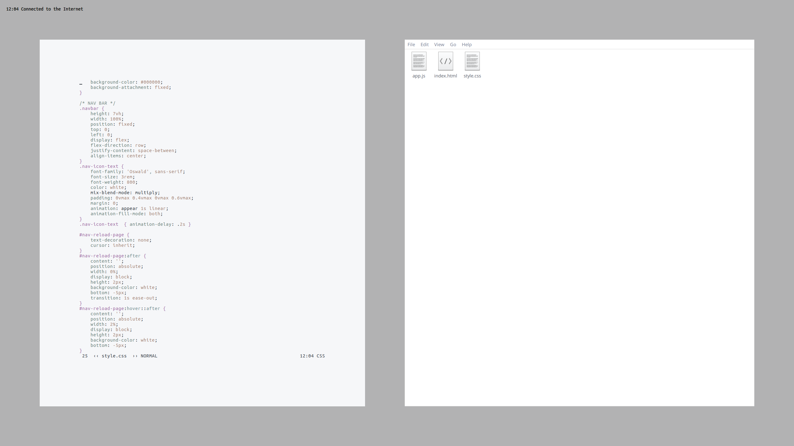

# mmWM
#### Modern Minimalistic Window Manager

mmWM is a dynamic window manager that is heavily based off of FrankenWM but with many _unnecessary_ features stripped out, and others added. Its goal is to simplify your workflow with some automated window management and less, more logical hotkeys.

_Menu on desktop is [xmenu](https://github.com/phillbush/xmenu)_

mmWM is lightweight. `smem` outputs USS and PSS at 368k and 409k respectively.

#### Minimalist Approach to Basic WM Features
Standard WM features (Can be toggled On/Off): Borders, Gaps, Panel, Follow Mouse, Multiple Desktops\
No per-app rules. All windows start tiled and focused on current desktop (unless desktop is _full_)\
Simplified, fewer, and more logical keyboard shortcuts following the pattern: {MOD4 + Single Key}\
Single Tiling mode: Main window + secondary & tertiary on the side

#### Added features
Automatic switch to next open desktop when opening a new window in a _full_ desktop\
Automatic switch to previous _populated_ desktop if last window on desktop is killed\
User defined maximum allowed windows per desktop\
A _smart_ gapless mode\
Command executed when clicking on root window / desktop

#### Other features
Brightness and volume XF86Keysym support for laptop keys (see Vendorkeys branch for code addition)\
Pywal Support (Must re-add this manually. See add_pywal_support.txt)

#### TODO
BUG FIX: If a desktkop is _full_, transient windows are mapped in next available desktop, not the current one

Installation
------------
You need xcb and xcb-utils then, copy `config.def.h` as `config.h` and edit to
suit your needs.  Build and install.

    $ cp config.def.h config.h
    $ $EDITOR config.h
    $ make
    # make clean install

Dependencies:
`libxcb` `xcb-util` `xcb-util-wm` `xcb-util-keysyms`

Configuration
-------------
You can configure mmWM by editing `config.h` before compiling.\

Usage
-----
Without panel: Add the following to your `.xinitrc`

    $ exec mmwm

With Panel:\
Download a panel script from [FrankenWM's Github page](https://gist.github.com/sulami/d6a53179d6d7479e0709), make it executable, and save it somewhere.

Add the following to your `.xinitrc`

    $ exec [PATH TO BAR SCRIPT]

Thanks
------

[FrankenWM by sulami](https://github.com/sulami/FrankenWM)\
[Customized Panel Scripts by shmalebx9](https://github.com/shmalebx9)\
[2bwm by venam](https://github.com/venam/2bwm)
