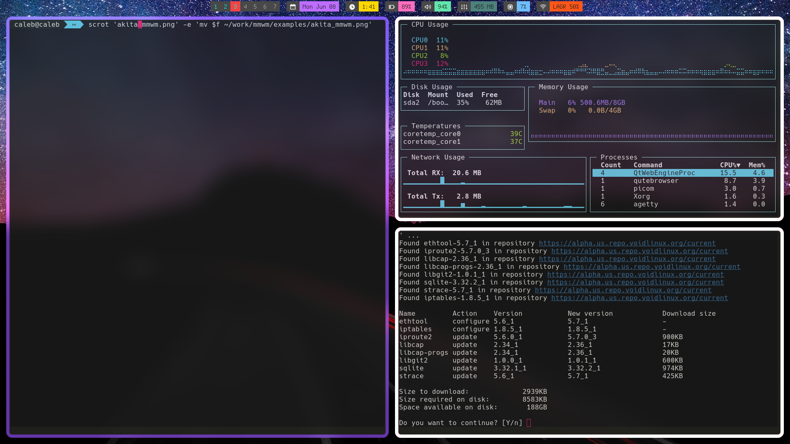
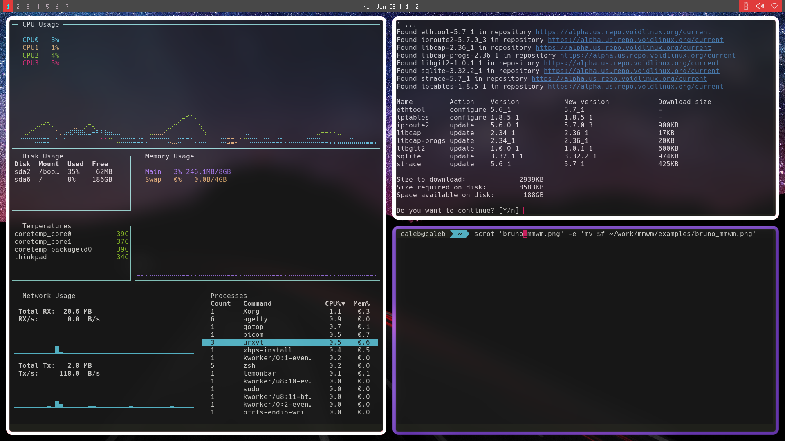

# mmWM Rice
#### more fully featured example panel scripts for lemonbar
## Requires
- lemonbar-xft
- acpid
- [Remix Icons](https://github.com/Remix-Design/RemixIcon/blob/master/fonts/remixicon.ttf) for akita script

#### Akita

#### Bruno

Credits
------

some bar scripts and inspiration from
[fsfg](https://gitlab.com/fsfg/dotfiles/)
[nan0s7](https://github.com/nan0s7/drowsylemon)

The icon font is created entirely from free icons not made by me. The icon font is made up of the following:

volume and clock Icons made by [Pixelmeetup](https://www.flaticon.com/authors/pixelmeetup) from www.flaticon.com
Battery Icons made by [phatplus](https://www.flaticon.com/authors/phatplus) from www.flaticon.com
Battery, date, and cpu Icons made by [Smashicons](https://www.flaticon.com/authors/smashicons) from www.flaticon.com
Calendar, cpu, wifi, volume, temperature, and other Icons made by freepik from www.flaticon.com
Calendar Icon made by [Catkuro](https://www.flaticon.com/authors/catkuro) from www.flaticon.com
Ram and cpu Icons made by [Vitaly Gorbachev](https://www.flaticon.com/authors/vitaly-gorbachev) from www.flaticon.com
Ram Icon made by [Good Ware](https://www.flaticon.com/authors/good-ware)  from www.flaticon.com
Cpu Icon made by [Prosymbols](https://www.flaticon.com/authors/prosymbols) from www.flaticon.com
Wifi Icons made by [Prettycons](https://www.flaticon.com/authors/prettycons) from www.flaticon.com
Cpu Icon made by [Monkik](https://www.flaticon.com/authors/monkik) from www.flaticon.com
Wifi Icons made by [Those Icons](https://www.flaticon.com/authors/those-icons) from www.flaticon.com
Wifi Icons made by [Pixel Perfect](https://www.flaticon.com/authors/pixel-perfect) from www.flaticon.com

[MMWM by kagum](https://github.com/kaugm/mmwm)

